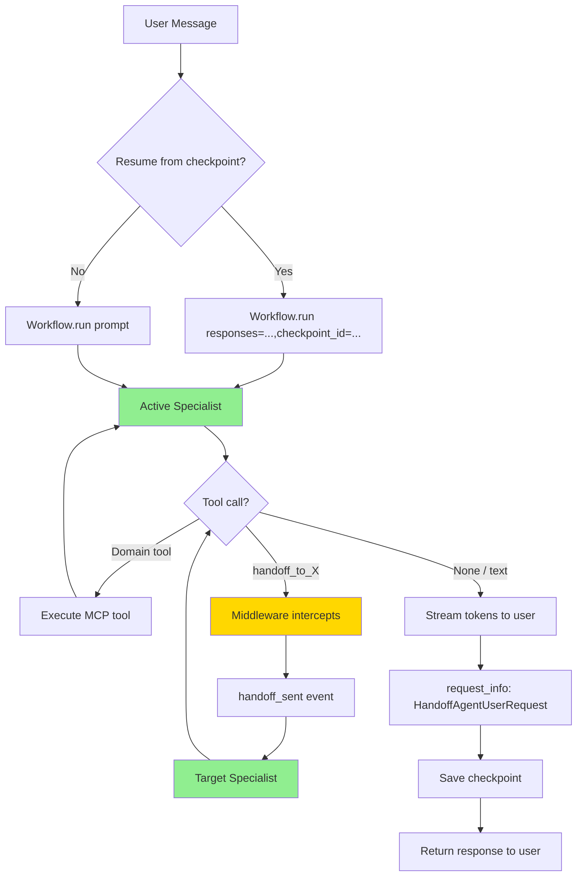

# Handoff Multi-Domain Agent

## Overview

A scalable domain-based routing pattern for customer support that uses the
**native `HandoffBuilder`** from `agent-framework-orchestrations` (1.2.x).
Each domain specialist talks to the user directly, and any specialist can
transfer the conversation to another specialist by calling an
auto-generated `handoff_to_<target>` tool. The framework intercepts those
calls and routes control accordingly — no hand-rolled intent classifier
or regex-based handoff detection is needed.

## Core Concept: Tool-Based Handoff

The key change from earlier workshop versions is that handoffs are now
**modeled as tool calls** that the agents themselves decide to invoke. The
`HandoffBuilder` does three things automatically:

1. **Synthesizes one handoff tool per allowed target** for every
   participant agent (e.g., `handoff_to_product_promotions`).
2. **Injects middleware** that intercepts those tool calls — they never
   actually execute, they just signal "route control to this target".
3. **Broadcasts the cleaned conversation** to the target agent so the new
   specialist sees the full conversation when it takes over (no manual
   context transfer required).

### How It Works

1. **Direct Communication** — The active specialist receives the user
   message, runs its own tool calls (filtered MCP tools for its domain),
   and replies.
2. **Self-Initiated Routing** — When a request is outside its domain, the
   specialist calls the appropriate `handoff_to_<target>` tool. This is
   declared in its instructions ("you MUST hand off to the appropriate
   specialist by calling the corresponding handoff tool").
3. **Workflow Routing** — `HandoffBuilder`'s middleware intercepts the
   tool call, emits a `handoff_sent` workflow event, and dispatches an
   `AgentExecutorRequest` to the target specialist with the full
   conversation history.
4. **Target Specialist Responds** — The new specialist sees the prior
   conversation and answers the user's request.

### Why This Design?

- **First-class framework support** — handoffs are part of the
  orchestration layer, not an application-level workaround.
- **No regex / classifier overhead** — the LLM decides when to hand off.
- **Conversation is shared automatically** — every specialist sees the
  full cleaned conversation, no manual `_build_context_prefix` step.
- **Less code to maintain** — the agent file went from 782 lines (with a
  hand-rolled `_classify_intent`, `_detect_handoff_request`, and
  `_build_context_prefix`) down to ~510 lines.

## Architecture



### Flow Description

1. **First Turn**: `chat_async` calls `workflow.run(prompt, stream=True)`.
   The configured start agent (`HANDOFF_DEFAULT_DOMAIN`) handles the
   message.
2. **Streaming**: `AgentResponseUpdate` events are forwarded to the
   WebSocket as `agent_token`/`tool_called` messages. `handoff_sent`
   events become `handoff_announcement` + a follow-up `agent_start`.
3. **Pause for User**: After the agent finishes (without handing off),
   the workflow emits a `request_info` event carrying a
   `HandoffAgentUserRequest`. We save the request ID alongside the
   checkpoint.
4. **Subsequent Turns**: `chat_async` resumes via
   `workflow.run(responses={request_id: HandoffAgentUserRequest.create_response(prompt)}, checkpoint_id=..., stream=True)`.
   The current specialist sees the new user message; if the topic
   shifts, it calls a `handoff_to_<target>` tool and routing happens
   automatically.

## Domain Specialists

| Domain | Expertise | Tools |
|--------|-----------|-------|
| **CRM & Billing** | Subscriptions, billing, invoices, payments, account adjustments | `get_customer_detail`, `get_subscription_detail`, `get_billing_summary`, `pay_invoice`, `update_subscription` + 4 more |
| **Product & Promotions** | Product catalog, promotions, eligibility, orders | `get_products`, `get_promotions`, `get_eligible_promotions`, `get_customer_orders` + 2 more |
| **Security & Authentication** | Account security, lockouts, authentication, incidents | `get_security_logs`, `unlock_account`, `get_support_tickets`, `create_support_ticket` + 1 more |

The agent **`description`** for each specialist is what `HandoffBuilder`
embeds into the auto-generated handoff tool description, so descriptions
should clearly state when control should transfer to that specialist.

## Key Implementation Details

### Tool Filtering

Each specialist receives a filtered subset of MCP tools via
`create_filtered_tool_list()`. The MCP server is connected once and
shared across all specialists.

**Benefits:** Security, focus, reduced hallucination, efficient resource
sharing.

### Cross-Request Continuity (Checkpointing)

The workshop runs each chat turn as a separate HTTP request, so the
workflow needs to persist its state between calls. We use
`HandoffBuilder.with_checkpointing(storage)` with a dictionary-backed
`CheckpointStorage` (`_DictCheckpointStorage`) keyed off the per-session
state store.

- After every turn the workflow saves a checkpoint and pauses on a
  `request_info` event waiting for the next user message.
- The next call passes `checkpoint_id` and `responses={pending_id: ...}`
  to resume the same conversation.

The pending request ID and current speaking domain are also persisted in
the state store so a process restart can re-create the workflow with the
correct start agent.

### Conversation Sharing

`HandoffBuilder` automatically broadcasts each agent's cleaned response
(without internal tool-call/result content) to all other agents in the
group. There is no longer a need for the per-domain "context prefix" the
previous implementation manually built.

### Handoff Tool Filtering in the UI

When streaming `function_call` content from the workflow, the agent
filters out any tool whose name starts with `handoff_to_` — these are
synthetic framework signals, not real tool invocations, and are already
surfaced as the higher-level `handoff_announcement` WebSocket event.

## Example: Multi-Turn Conversation

```
Turn 1
User: "What's my bill?"
→ Start agent (crm_billing) handles the message.
crm_billing: "Your bill is $45.99…"
→ Workflow pauses on request_info; checkpoint saved.

Turn 2 (within domain)
User: "Can I see the line items?"
→ Resume from checkpoint with responses={pending_id: ...}
→ crm_billing answers directly.
crm_billing: "Basic plan $30, Data $15.99…"

Turn 3 (out-of-domain)
User: "What promotions am I eligible for?"
→ Resume from checkpoint.
→ crm_billing's instructions tell it to call handoff_to_product_promotions.
→ HandoffBuilder middleware intercepts and emits handoff_sent.
→ product_promotions sees the full conversation and responds.
product_promotions: "You qualify for 3 active promotions…"
```

## Configuration

| Environment Variable | Default | Description |
|---------------------|---------|-------------|
| `HANDOFF_DEFAULT_DOMAIN` | `crm_billing` | Starting domain for the first turn (`crm_billing` \| `product_promotions` \| `security_authentication`) |
| `AZURE_OPENAI_API_KEY` | (required for key auth) | Azure OpenAI API key |
| `AZURE_OPENAI_ENDPOINT` | (required) | Azure OpenAI endpoint URL |
| `AZURE_OPENAI_CHAT_DEPLOYMENT` | (required) | Azure deployment name (passed to `OpenAIChatClient` as `model=`) |
| `MCP_SERVER_URI` | (optional) | MCP server endpoint for domain tools |
| `AGENT_MODULE` | – | `agents.agent_framework.multi_agent.handoff_multi_domain_agent` |

> The legacy `HANDOFF_LAZY_CLASSIFICATION` and
> `HANDOFF_CONTEXT_TRANSFER_TURNS` settings are no longer used: native
> handoffs are always agent-driven and the workflow shares conversation
> state between specialists automatically.

## Advantages

✅ **Native framework support** — handoffs are part of the orchestration
layer, not an application workaround.
✅ **Less code to maintain** — no hand-rolled classifier, regex
detection, or context prefix builder.
✅ **Agent-decided routing** — the LLM decides when to hand off, with
clear handoff-tool descriptions to guide it.
✅ **Automatic shared conversation** — every specialist sees the cleaned
conversation when it takes over.
✅ **Resumable conversations** — workflow checkpointing persists state
across HTTP requests.

## When to Use

**Good fit:**
- Support scenarios with clear domain boundaries
- Want to minimize latency and cost
- Need to scale to many specialist agents

**Not ideal:**
- Tasks requiring simultaneous multi-agent collaboration → use
  `MagenticBuilder` instead.
- Complex workflows with explicit dependencies between agents → use
  `WorkflowBuilder` with custom edges.
